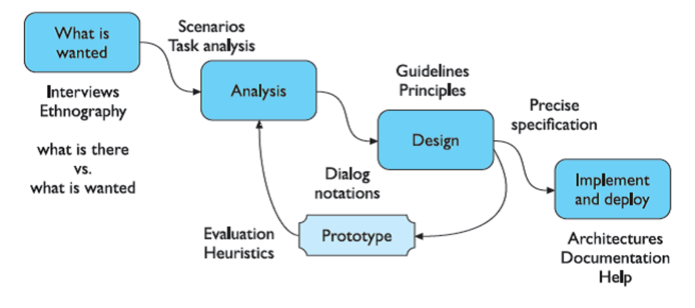

## HCI

- What is HCI? interdisciplinary
- Why does HCI matter: affect business results
- History of HCI: this is a new concept and being researched recently
- The 4 stages of HCI: intention, selection, execution, evaluation.
  - Q: The selection stage is within a system (select button, menu, etc.) or might be about between many systems?
- HCI Research Components: Task, People, Devices, Environment.
- Có khá nhiều cách nói về việc một HCI Design như thế nào là tốt. Mình chỉ suy nghĩ đơn giản là thấy tốt thì tốt thui =)
- History of HCI
  - Composed from many fields, relating to human mind, ergonomics and systems

## Interaction Paradigms

- Paradigms are the way of designing a product can be used for future
- Some paradigms: real-time sharing, graphics display, personal computer, window systems, WIMP (Windows), direct manipulation (WYSIWYG)
  - real-time sharing: multi-user product?
  - video graphics display: sketchpad?
  - personal computing: no distinguishing structure between personal computer and large(? - I mean I don't remember classes of computers) computer
  - windowing systems and wimp interface
  - language versus action???
  - .Computer-supported cooperative work???
  - Hypertext
  - WWW
- And many extremely modern paradigms like: AR/VR, eye-tracking tech, etc.

## Interactive System

- What is UX/UI?
  - UI types: GUI, VUI, VR.

## Interactive System Components

- Human
- Env and context
- Computer and interaction tech
- Development Process

## IS Examples

- Compare ISD and SE
- Development Process of ISD and SE, how they are different?
  - in UX/UI, you have many prototypes

