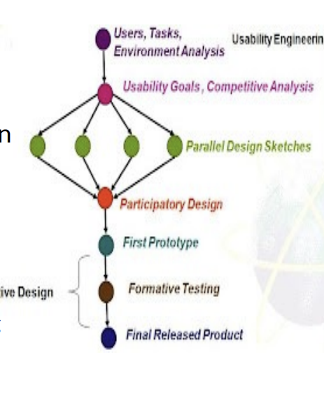

## Usability

- What is usability?
  - The ease of use and learnability of a human-made object such as a tool or device.
  - Comparing to usefulness?
    - Usability is about how easy to use the product
    - Usefulness is about how the product can be used to solve the problem
- 4 UX levels: utility -> usability -> desirability -> ux

### History

- New concept (I guess everything here are all new concepts)

### Definition

- usability: Can it be used? How easy and friendly is that?
- Some principles, core factors and quality components, but I don't really understand if I don't have ChatGPT to ask for explaination
- why does usability matter?
  - human are lazy. definitely lol. (I hate laziness though) -> ease of use is important
- compare usability with ux
  - ux is more subjective, related to users feelings
- four levels of ux: utility->usability->desirability->ux (level of subjective)
  - desirability: usability + aesthetics

## Examples (skipped)

## Usability in HCI

- usability is a part of HCI
- design principles that I hardly bother to memorize
  - Learnability
  - Flexibility
    - About custom UI
      - pros and cons
  - Robustness
- I don't really understand this part. I mean of course Usability is a part of HCI, why do I have the feeling of they are making usability not a part of HCI but something co-existing with HCI?
- Usability design principles given by Dix 1998
  - Learnability
  - Flexibility
    - Q: Pros and cons of customizable UI?
  - Robustness

## Usability in UI/UX design

- I still don't get the way usability stand alone and being compare to UX/UI and HCI.
- It's just too important to be mentioned why it's important for UX/UI.
- I think the lecture is so abstract. Just designing a product is a must to apply the knowledge
- Example of a coffee machine
- Usability Engineering
  - The lifecycle is kinda similar to interaction system cycle
  
  - Each steps have detail implementation but I'm too lazy man.

## ISO of Usability

- Why do we need ISO?
- Some discussions in this part seems intriguing but I haven't had the time to learn. Low priority. So sorry.