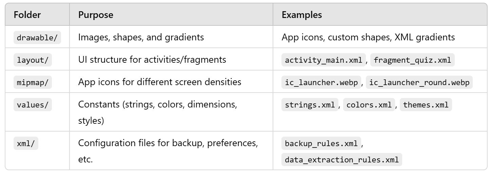

- Android UI
    - View
        - TextView
        - EditText
        - Button
        - ImageView
        - CustomView
        - etc.
    - ViewGroup
        - LinearLayout: 
            - orientation: vertical, horizontal
        - ConstraintLayout: flexible
        - RecyclerView: scrollable list or grid
        - etc.

- Project Structure
    - manifest
        - AndroidManifest.xml: defines basic app's info and components
    - kotlin+java: source code
        - app's package name
        - test: unit tests
        - androidTest: UI tests
    - res: resources
                
    - Gradle Scripts    

- Activity
    - an activity = a screen
    - base class: AppCompatActivity
    - lifecycle: onCreate(), onStart(), onResume(), onPause(), onStop(), onDestroy()
    - Intent: navigating between activities

