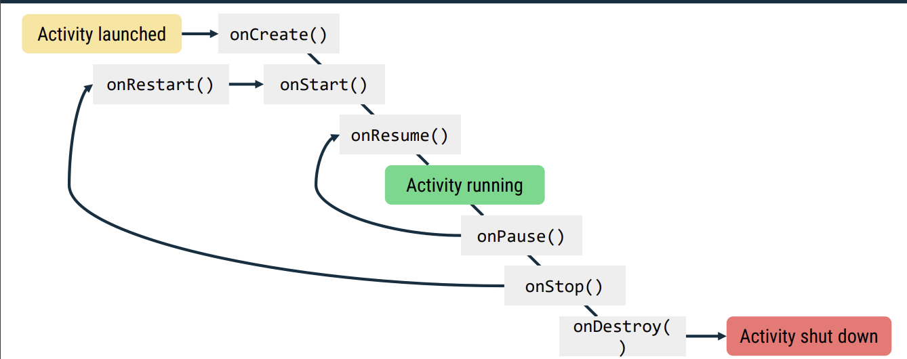
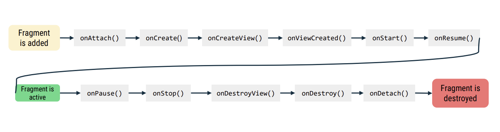

## Activity Lifecycle

- onCreate(): must be implemented
- onStart(): called when the activity is becoming visible to the user
- onResume(): called when the activity will start interacting with the user
- onPause(): called when the activity still visible but not interacting with the user
- onStop(): called when the activity is no longer visible to the user
- onDestroy(): called when the activity is being destroyed

## Logging

- Log methods

## Fragment Lifecycle

- onAttach(): called when the fragment is associated with an activity/context
- onCreateView(): called when the fragment is created
- onViewCreated(): called when the fragment's view is created
- onStart(): called when the fragment is visible to the user
- onResume(): called when the fragment is interacting with the user
- onPause(): called when the fragment is still visible but not interacting with the user
- onStop(): called when the fragment is no longer visible to the user
- onDestroyView(): called when the fragment's view is destroyed
- onDestroy(): called when the fragment is being destroyed

## Lifecycle-aware components?

- LifecycleOwner
- LifecycleObserver
