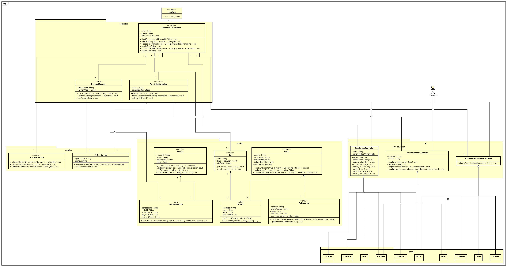
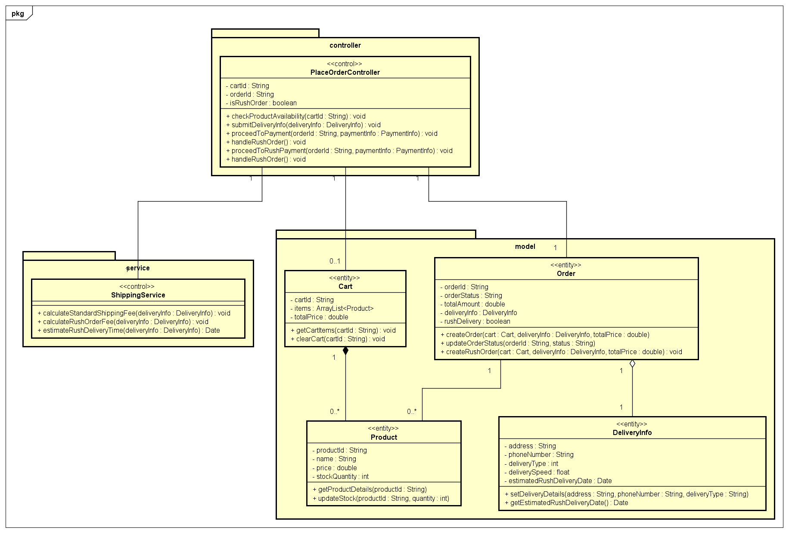
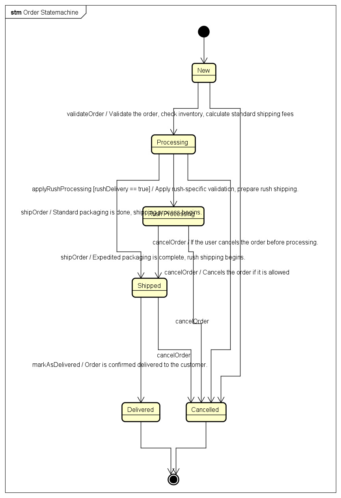

# 4.4 Class Design

## 4.4.1 General Overview

This section details the expanded class design for the "Pay Order," "Place Order," and "Place Rush Order" use cases. The class diagrams now incorporate additional entities, services, and controllers that are crucial for managing different aspects of the ordering and payment systems. The purpose of this design is to provide a modular and maintainable architecture, emphasizing the importance of clearly defined packages and subsystems.

The design integrates key elements like orders, inventory management, payments, and delivery handling, and also introduces packages and subsystems to organize related components logically.

## 4.4.2 Class Diagrams

Below is the detailed class diagram for the use cases, highlighting the core components and their relationships. Each class is described with its attributes and operations, and classes are grouped into packages and subsystems.

### 4.4.2.1 Package: `Controller`

This package contains classes responsible for handling user interactions and managing business logic.

#### Class: `PlaceOrderController`

**Purpose**: Manages the order placement process, including checking product availability and submitting delivery info.

##### Attributes

| #   | Name        | Data Type | Default Value | Description                                   |
| --- | ----------- | --------- | ------------- | --------------------------------------------- |
| 1   | orderId     | String    | None          | ID of the order being processed.              |
| 2   | cartId      | String    | None          | ID of the customer's shopping cart.           |
| 3   | isRushOrder | boolean   | false         | Flag indicating if the order is a rush order. |

##### Operations

| #   | Name                     | Return Type | Description                                  |
| --- | ------------------------ | ----------- | -------------------------------------------- |
| 1   | handleRushOrder          | void        | Handles the rush order process.              |
| 2   | proceedToPayment         | void        | Initiates payment for the current order.     |
| 3   | submitDeliveryInfo       | void        | Submits delivery information for the order.  |
| 4   | checkProductAvailability | void        | Checks if the product is available in stock. |

#### Class: `PayOrderController`

**Purpose**: Oversees the payment workflow for an order.

##### Attributes

| #   | Name          | Data Type | Default Value | Description                                  |
| --- | ------------- | --------- | ------------- | -------------------------------------------- |
| 1   | paymentStatus | String    | 'Pending'     | Current status of the payment.               |
| 2   | orderId       | String    | None          | ID of the order associated with the payment. |

##### Operations

| #   | Name                    | Return Type | Description                                        |
| --- | ----------------------- | ----------- | -------------------------------------------------- |
| 1   | initiatePayment         | void        | Starts the payment process for a given order.      |
| 2   | handleOrderConfirmation | void        | Manages the confirmation after an order is placed. |

### 4.4.2.2 Package: `Model`

This package contains entity classes representing data and states within the system.

#### Class: `Order`

**Purpose**: Represents a customer's order, handling standard and rush delivery details.

##### Attributes

| #   | Name         | Data Type    | Default Value | Description                                |
| --- | ------------ | ------------ | ------------- | ------------------------------------------ |
| 1   | orderId      | String       | None          | Unique identifier for each order.          |
| 2   | orderStatus  | String       | 'Pending'     | Current status of the order.               |
| 3   | deliveryInfo | DeliveryInfo | None          | Details about delivery, including address. |
| 4   | totalAmount  | double       | 0.0           | Total amount for the order.                |
| 5   | rushDelivery | boolean      | false         | Indicates if the order is a rush delivery. |

##### Operations

| #   | Name              | Return Type | Description                                             |
| --- | ----------------- | ----------- | ------------------------------------------------------- |
| 1   | createOrder       | void        | Creates a new order with cart and delivery information. |
| 2   | updateOrderStatus | void        | Updates the status of an order (e.g., 'Shipped').       |
| 3   | createRushOrder   | void        | Creates a rush order with additional delivery options.  |

#### Class: `Invoice`

**Purpose**: Manages invoice details, including validation and total calculation.

##### Attributes

| #   | Name        | Data Type | Default Value | Description                           |
| --- | ----------- | --------- | ------------- | ------------------------------------- |
| 1   | invoiceId   | String    | None          | Unique identifier for each invoice.   |
| 2   | status      | String    | 'Unpaid'      | Status of the invoice (e.g., 'Paid'). |
| 3   | totalAmount | double    | 0.0           | Total amount for the invoice.         |
| 4   | orderId     | String    | None          | Reference to the associated order.    |

##### Operations

| #   | Name              | Return Type             | Description                      |
| --- | ----------------- | ----------------------- | -------------------------------- |
| 1   | getInvoiceDetails | InvoiceDetails          | Retrieves details of an invoice. |
| 2   | validateInvoice   | InvoiceValidationResult | Validates the invoice data.      |

#### Class: `Product`

**Purpose**: Represents an item that can be purchased, including its stock and pricing information.

##### Attributes

| #   | Name          | Data Type | Default Value | Description                         |
| --- | ------------- | --------- | ------------- | ----------------------------------- |
| 1   | productId     | String    | None          | Unique identifier for each product. |
| 2   | name          | String    | None          | Name of the product.                |
| 3   | price         | double    | 0.0           | Price of the product.               |
| 4   | stockQuantity | int       | 0             | Current stock level of the product. |

##### Operations

| #   | Name              | Return Type | Description                                  |
| --- | ----------------- | ----------- | -------------------------------------------- |
| 1   | getProductDetails | void        | Retrieves detailed information of a product. |
| 2   | updateStock       | void        | Updates the stock level of a product.        |

#### Class: `Cart`

**Purpose**: Represents a shopping cart that contains multiple products for a customer.

##### Attributes

| #   | Name       | Data Type          | Default Value | Description                               |
| --- | ---------- | ------------------ | ------------- | ----------------------------------------- |
| 1   | cartId     | String             | None          | Unique identifier for each shopping cart. |
| 2   | items      | ArrayList<Product> | Empty List    | List of products in the cart.             |
| 3   | totalPrice | double             | 0.0           | Total price of all items in the cart.     |

##### Operations

| #   | Name         | Return Type | Description                             |
| --- | ------------ | ----------- | --------------------------------------- |
| 1   | getCartItems | void        | Retrieves items from the shopping cart. |
| 2   | clearCart    | void        | Removes all items from the cart.        |

#### Class: `TransactionInfo`

**Purpose**: Keeps track of payment transactions related to orders.

##### Attributes

| #   | Name          | Data Type | Default Value | Description                             |
| --- | ------------- | --------- | ------------- | --------------------------------------- |
| 1   | transactionId | String    | None          | Unique identifier for each transaction. |
| 2   | paymentStatus | String    | 'Pending'     | Current status of the payment.          |
| 3   | amountPaid    | double    | 0.0           | Total amount paid in the transaction.   |
| 4   | paymentDate   | Date      | None          | Date of the payment transaction.        |

##### Operations

| #   | Name             | Return Type | Description                                             |
| --- | ---------------- | ----------- | ------------------------------------------------------- |
| 1   | saveTransaction  | void        | Saves transaction details for a completed order.        |
| 2   | getPaymentStatus | String      | Retrieves the status of a specific payment transaction. |

### 4.4.2.3 Package: `Service`

This package includes service classes responsible for external interactions and specific calculations.

#### Class: `ShippingService`

**Purpose**: Calculates shipping fees and estimates delivery times.

##### Attributes

| #   | Name   | Data Type | Default Value | Description                                          |
| --- | ------ | --------- | ------------- | ---------------------------------------------------- |
| 1   | apiKey | String    | None          | API key for accessing third-party shipping services. |

##### Operations

| #   | Name                         | Return Type | Description                                    |
| --- | ---------------------------- | ----------- | ---------------------------------------------- |
| 1   | calculateStandardShippingFee | void        | Calculates shipping fee for standard delivery. |
| 2   | calculateRushOrderFee        | void        | Calculates additional fee for rush delivery.   |
| 3   | estimateRushDeliveryTime     | Date        | Estimates delivery time for rush orders.       |

#### Class: `PaymentService`

**Purpose**: Handles payment processing, including interactions with payment gateways.

##### Attributes

| #   | Name          | Data Type | Default Value | Description                                    |
| --- | ------------- | --------- | ------------- | ---------------------------------------------- |
| 1   | paymentStatus | String    | 'Pending'     | Current status of the payment.                 |
| 2   | transactionId | String    | None          | Unique identifier for the payment transaction. |

##### Operations

| #   | Name               | Return Type   | Description                                           |
| --- | ------------------ | ------------- | ----------------------------------------------------- |
| 1   | processPayment     | void          | Processes payment using provided payment information. |
| 2   | getPaymentResult   | PaymentResult | Retrieves the result of a payment attempt.            |
| 3   | savePaymentDetails | void          | Saves payment details after successful transaction.   |

#### Class: `VNPayService`

**Purpose**: A specific payment service class for VNPay integration, facilitating transactions.

##### Attributes

| #   | Name        | Data Type | Default Value | Description                                    |
| --- | ----------- | --------- | ------------- | ---------------------------------------------- |
| 1   | apiKey      | String    | None          | VNPay API key for secure transaction handling. |
| 2   | apiEndpoint | String    | None          | URL endpoint for VNPay transactions.           |

##### Operations

| #   | Name                | Return Type   | Description                                           |
| --- | ------------------- | ------------- | ----------------------------------------------------- |
| 1   | sendPaymentResult   | void          | Sends the payment result to the client.               |
| 2   | processPayment      | PaymentResult | Processes a payment via VNPay.                        |
| 3   | validateTransaction | boolean       | Validates a transaction's authenticity through VNPay. |

### 4.4.2.4 Subsystems

Subsystems organize related components to manage complex functionalities.

#### Subsystem: `Order Management`

This subsystem manages all order-related operations, ensuring the accurate creation, processing, and updating of orders.

- **Classes Included**: `Order`, `Cart`, `Product`, `Invoice`.
- **Controllers Included**: `PlaceOrderController`, `PayOrderController`.

##### Purpose

To maintain a clear separation of order-related logic, such as managing the product lifecycle from cart addition to order creation, updating order statuses, and handling inventory.

#### Subsystem: `Payment Processing`

This subsystem handles all payment-related operations, ensuring secure and seamless transaction flows for customers.

- **Classes Included**: `PaymentService`, `TransactionInfo`, `VNPayService`.
- **Controllers Included**: `InvoiceScreenController`, `SuccessOrderScreenController`.

##### Purpose

To manage all payment-related workflows, including initiating payments, processing transactions, and storing payment details. This subsystem also covers integration with third-party payment services like VNPay.

#### Subsystem: `Delivery Management`

This subsystem oversees delivery and shipping logistics, including fee calculation, delivery type determination, and rush delivery estimates.

- **Classes Included**: `DeliveryInfo`, `ShippingService`.
- **Controllers Included**: `CartScreenController`, `SuccessOrderScreenController`.

##### Purpose

To manage delivery-related aspects, focusing on delivery information storage, standard and rush delivery fee calculations, and estimated delivery times.

## 4.4.3 Reasoning Behind the Design

### Overview

The design is structured to maintain modularity, ensuring that changes in one part of the system have minimal impact on others. This separation into packages and subsystems supports scalability and maintainability, aligning with object-oriented principles. The key considerations are:

- **Encapsulation**: Each class handles specific responsibilities, encapsulating behavior and data.
- **Cohesion**: High cohesion within each class and subsystem ensures that related functions are grouped together, making the system more understandable and easier to maintain.
- **Separation of Concerns**: Clear distinction between business logic (controllers), data models (entities), and services (e.g., `PaymentService`), enhancing modularity.

### Improvements Suggested

1. **Modular Expansion**: Consider breaking down larger classes if they grow beyond their single responsibility. For example, if payment services expand to include multiple payment gateways, create subclasses for each gateway.
2. **Error Handling**: Introduce a dedicated error-handling subsystem or classes within each package to handle exceptions gracefully.
3. **Use of Interfaces**: If additional payment services are integrated, define a `PaymentGateway` interface to ensure consistent implementation across services.
