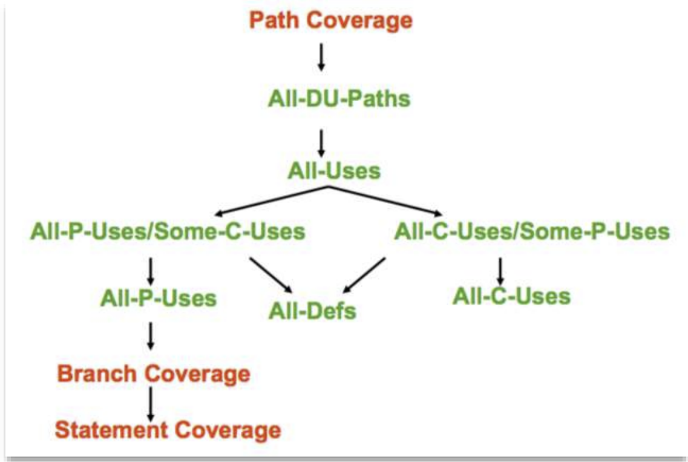

# Lecture 5: White Box Approach

## 5.1 White Box Testing

- Comparing black box and white box testing

## 5.2 Control Flow Testing

- Terms: input -> Unit -> different program paths
- Control flow Graph and testing
  - Test certain paths due to huge number of potential paths
  - Some criteria for path selection
  - There is an outline for the testing process in the lecture slide
- Path testing techniques: all path > branch > statement
- There are limitations for this testing approach but I don't understand

## 5.3 Predicate Coverage

- Something relating to boolean variables and expressions
- A predicate is an expression that evaluates to true or false
- Predicate coverage is a white box test design technique that ensures that all possible outcomes of predicate expressions are tested (but isn't the outcomes are only in true or false?)
- Clause coverage: choosing test case that each clause is tested in both true and false state
- Combinatorial coverage: I haven't understood
- Active/Major clauses
- Active Clauses and a whole bunch of coverage criteria that I can't remember now

## 5.4 Data Flow Testing

- Defined variable
- Used variable
  - p-use: used in a predicate
  - c-use: used in a computation
  - can be both used and re-defined. e.g. y += x;
- Terminology
  - Definition clear path: variable doesn't being redefined
  - Complete path
    - What is an initial and a exit node?
  - Def use pair: (d, u) of v 
- Data flow test Coverage Criteria

### More dataflow terms and definitions

- simple path: all edges are distinct.
- loop-free path: all nodes are distinct.
- all du-paths coverage

## Mutation Testing

- Cool but I wonder if I'll ever use it in my life.