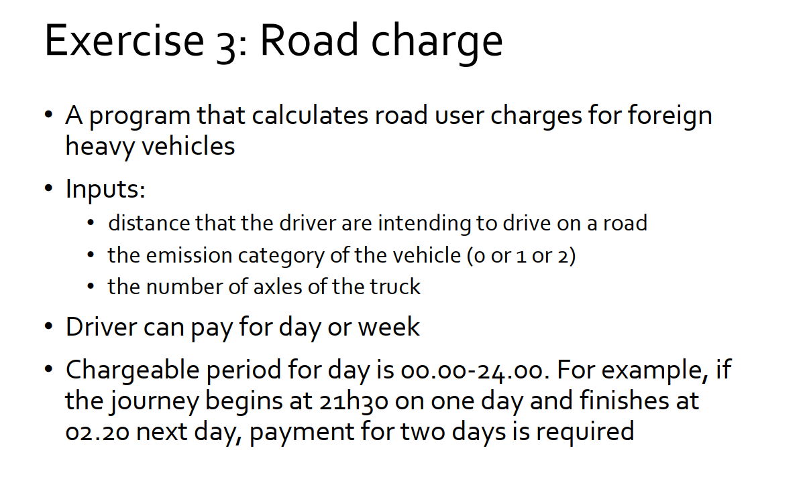
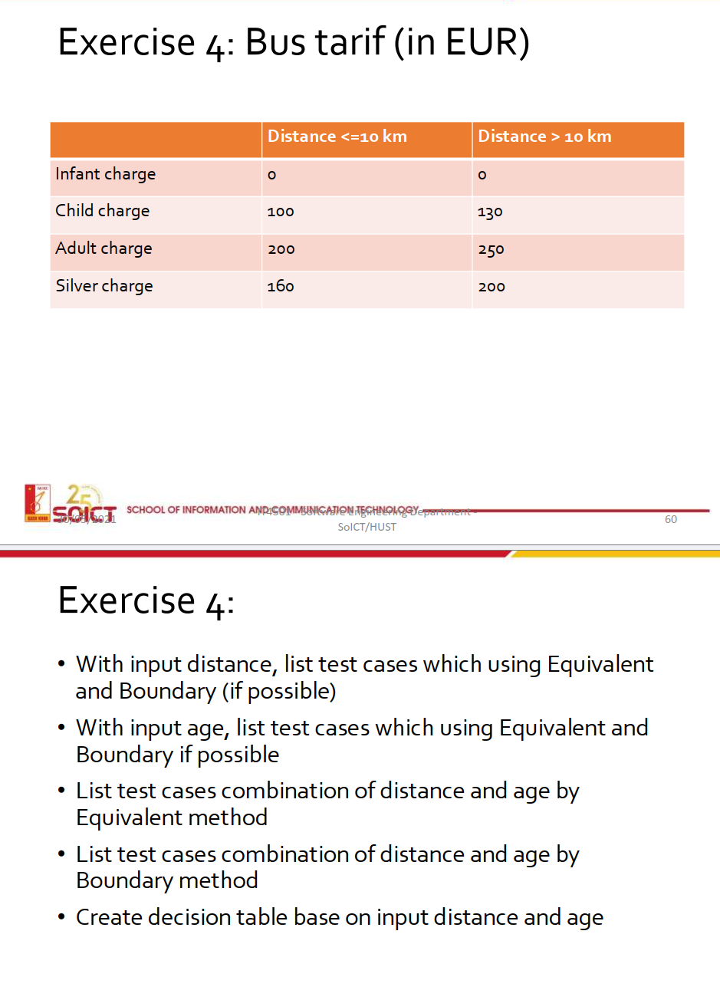

## Exercise 3: Road charge

The problem statement is so hard to be understood.

O1's response:

Below is one way you could restate the same scenario so that it’s clearer and more “decision‐table‐ready.” Feel free to tweak details to suit your exact needs, but this version is typically easier to break down into conditions and outcomes.

---

### Revised Exercise: Road Charge Calculation for Foreign Heavy Vehicles

You are to develop a program that calculates the total road user charge for a foreign heavy vehicle. The program must support two payment options: a **daily** pass or a **weekly** pass.

### Inputs

1. **Journey Start Time** and **End Time**  
   - Used to determine on how many *calendar days* the vehicle is actually on the road.
   - A *calendar day* is from **00:00** (midnight) to **23:59** on that same date.
2. **Emission Category**: An integer value in \{0, 1, 2\}.  
3. **Number of Axles**: An integer value (e.g., 2, 3, 4, …).  
4. **Distance Traveled** (in kilometers): The intended distance for the trip.
5. **Payment Option**: “Day” or “Week.”

### Rules & Requirements

1. **Daily Charge Window**  
   - Each daily pass is valid from **00:00** to **23:59** of a single calendar day.  
   - If a trip crosses into a second (or third, etc.) calendar day (for example, starting at 21:30 on Day 1 and ending at 02:20 on Day 2), **an additional daily pass** is required for each extra day.

2. **Weekly Pass**  
   - A weekly pass is valid for a continuous 7-day period (e.g., from Monday 00:00 through the following Sunday 23:59).
   - If the journey extends beyond that 7-day window, another weekly pass must be purchased.

3. **Emission Category Charges**  
   - Emission category **0** has the lowest daily/weekly base charge.  
   - Emission category **1** has a higher daily/weekly base charge.  
   - Emission category **2** has the highest daily/weekly base charge.

4. **Axle Surcharge**  
   - Trucks with **2 axles** pay a standard rate.  
   - Each axle above 2 adds an extra surcharge (daily or weekly, depending on the chosen payment option).

5. **Distance Factor**  
   - If the vehicle travels **beyond a certain distance threshold** in a single day, an additional “distance fee” is applied.  
   - (For instance, if traveling over 250 km in one day, add a specific amount to that day’s charge.)

### Outputs

- **Total Amount Payable** for the journey, calculated according to:  
  - Number of daily or weekly passes needed  
  - Emission category base rate  
  - Axle‐based surcharges  
  - Distance‐based surcharges (if any)

---

### Why This Version Is Easier for Decision Tables

1. **Clearly Defined Inputs**: The program receives five distinct inputs (start/end times, emission category, axles, distance, and payment choice).  
2. **Discrete Conditions**:  
   - Emission category is one of 0, 1, or 2.  
   - Axles >= 2, plus a surcharge rule for each axle above 2.  
   - Payment choice is exactly “Day” or “Week.”  
   - Journeys can fall into 1 day or multiple days (and similarly 1 or multiple weeks).  
   - Distance either below or above a threshold.  
3. **Straightforward Outcomes**: The result is simply the “total charge,” but you arrive there by combining decisions about days vs. weeks, emission category, axles, and distance. Each unique combination of those conditions can be a row in the decision table, with the “total charge” (or how it’s computed) as the outcome.

With the revised exercise statement, you can more cleanly set up a **decision table** by listing each condition (e.g., “Payment = Day?”, “Emission Category = 0, 1, or 2?”, “Number of Axles = 2, or > 2?”, “Distance <= threshold or > threshold?”, “Journey crosses >1 day boundary?”) across the top or left side, then marking the outcomes or actions for each combination.

---

### Example Decision Table Skeleton

Below is just a *skeleton* to give you an idea. You’d fill in actual values, surcharges, and so on.

| **Conditions**                        | **Rule 1** | **Rule 2** | **Rule 3** | **Rule 4** | … |
|--------------------------------------|-----------|-----------|-----------|-----------|---|
| Payment Type = Day / Week           | Day       | Day       | Week      | Week      | … |
| Emission Category (0/1/2)           | 0         | 2         | 1         | 2         | … |
| Axles (<=2 or >2)                   | 2         | 3         | 2         | 5         | … |
| Distance Over Threshold? (Yes/No)   | No        | Yes       | No        | Yes       | … |
| Crosses >1 Day? (Yes/No)            | No        | Yes       | – (N/A)   | – (N/A)   | … |
| **Actions / Outcomes**              |           |           |           |           |   |
| # of Daily/Weekly Passes to Buy     | 1         | 2         | 1         | 1         | … |
| Base Rate for Emission Category     | $X        | $Z        | $Y weekly | $Z weekly | … |
| Axle Surcharge?                     | 0         | +$A       | 0         | +$B       | … |
| Distance Surcharge?                 | 0         | +$C       | 0         | +$C       | … |
| **Total**                            | $X        | $someSum  | $someSum  | $someSum  | … |

Once you’ve completed the table, you’ll have all the scenarios covered.

---

Feel free to adjust the specific thresholds, surcharges, or rules in any way that makes sense. The key to a good decision‐table exercise is that each condition is **discrete** (i.e., you can say “Yes/No,” or pick one of a small set of categories) and that every combination leads to a clear action or outcome.

## Exercise 4: Bus tariffs

Below is a **worked‐through example** of how you might address *all* parts of Exercise 4—covering Equivalence Partitioning (EP), Boundary Value Analysis (BVA), and Decision Tables—using the sample bus‐tariff rules from the image.

> **Important**: The original slide does not specify exact age boundaries for “infant,” “child,” “adult,” and “silver.” In order to demonstrate EP/BVA, we’ll **assume** typical age ranges. If your actual specification defines different cutoffs, just adjust accordingly.

---

## 1. The Tariff Rules (Given)

| **Category** | **Distance ≤ 10 km** | **Distance > 10 km** |
|-------------:|---------------------:|---------------------:|
| **Infant**   | 0 EUR               | 0 EUR               |
| **Child**    | 100 EUR             | 130 EUR             |
| **Adult**    | 200 EUR             | 250 EUR             |
| **Silver**   | 160 EUR             | 200 EUR             |

Where:

- **Distance** is a numeric input (e.g., an integer or float).
- **Age** determines category (Infant / Child / Adult / Silver).

### Assumed Age Ranges
1. **Infant**: 0–1 years (inclusive)  
2. **Child**: 2–12 years (inclusive)  
3. **Adult**: 13–59 years (inclusive)  
4. **Silver**: ≥ 60 years  

*(Feel free to adjust these to match any real or given specification.)*

---

## 2. With *Distance* as Input: EP and BVA Test Cases

### 2.1 Equivalence Partitions (EP) for Distance
We have two main “partitions” from the table:

- **Partition A**: Distance **≤ 10** km  
- **Partition B**: Distance **> 10** km  

Any distance values that fall within each partition should behave the same for pricing. So for EP, you might choose:

1. **Partition A Representative** (e.g., 5 km, or 10 km)
2. **Partition B Representative** (e.g., 15 km)

### 2.2 Boundary Value Analysis (BVA) for Distance
We identify the critical boundary at **10 km**. Typical BVA technique checks the values **just below**, **equal to**, and **just above** that boundary:

- **Just below**: 9.99 km (or 10 − ε if using integer steps, 9 or 10).
- **Exact boundary**: 10 km.
- **Just above**: 10.01 km (or 11 if integer steps).

#### Example BVA Test Set for Distance
1. **d = 0** (minimum plausible distance, also can be interesting if zero‐distance is allowed)  
2. **d = 9.99** (or 9/10)  
3. **d = 10**  
4. **d = 10.01** (or 11)  
5. **d = some large value** (e.g., 100 km, to confirm > 10 km behavior)

*(In practice, you might also consider negative or nonsensical distances as error cases, but that depends on whether your system must handle invalid input.)*

---

## 3. With *Age* as Input: EP and BVA Test Cases

Because the exercise focuses on “Infant,” “Child,” “Adult,” and “Silver,” we’ll define:

- Boundary 1: 1–2 years (the line between **Infant** and **Child**)  
- Boundary 2: 12–13 years (the line between **Child** and **Adult**)  
- Boundary 3: 59–60 years (the line between **Adult** and **Silver**)  

### 3.1 Equivalence Partitions for Age
- **Partition I**: 0–1 → Infant  
- **Partition II**: 2–12 → Child  
- **Partition III**: 13–59 → Adult  
- **Partition IV**: ≥ 60 → Silver  

Possible representative ages:
- **Infant**: age = 1  
- **Child**: age = 7  
- **Adult**: age = 30  
- **Silver**: age = 75  

### 3.2 Boundary Value Analysis for Age
Check each boundary “just below,” “exact,” and “just above”:

1. **Boundary between Infant and Child**: 1 → 2  
   - Just below 2: age = 1  
   - Exact boundary: age = 2  
   - Just above 2: age = 3  

2. **Boundary between Child and Adult**: 12 → 13  
   - Just below 13: age = 12  
   - Exact boundary: age = 13  
   - Just above 13: age = 14  

3. **Boundary between Adult and Silver**: 59 → 60  
   - Just below 60: age = 59  
   - Exact boundary: age = 60  
   - Just above 60: age = 61  

*(Additionally, consider age = 0 if the system allows an infant of age “0.”)*

---

## 4. Combining *Distance* and *Age*: EP‐Based Test Cases

When combining **two sets of partitions**, each combination is a “class” in the sense of EP. We have:

- **Distance**: (A) ≤ 10, (B) > 10  
- **Age**:  
  - (I) Infant  
  - (II) Child  
  - (III) Adult  
  - (IV) Silver  

Hence, we get **2 × 4 = 8** equivalence classes:

| **#** | **Distance** Partition | **Age** Partition  | Example Input (Distance, Age) | Expected Tariff   |
|------:|:-----------------------|:-------------------|:-----------------------------|:------------------|
| 1     | ≤ 10 (A)               | Infant (I)         | (5 km, 1 yr)                 | 0 EUR             |
| 2     | ≤ 10 (A)               | Child (II)         | (10 km, 7 yr)                | 100 EUR           |
| 3     | ≤ 10 (A)               | Adult (III)        | (10 km, 30 yr)               | 200 EUR           |
| 4     | ≤ 10 (A)               | Silver (IV)        | (5 km, 70 yr)                | 160 EUR           |
| 5     | > 10 (B)               | Infant (I)         | (15 km, 1 yr)                | 0 EUR             |
| 6     | > 10 (B)               | Child (II)         | (11 km, 7 yr)                | 130 EUR           |
| 7     | > 10 (B)               | Adult (III)        | (99 km, 45 yr)               | 250 EUR           |
| 8     | > 10 (B)               | Silver (IV)        | (20 km, 75 yr)               | 200 EUR           |

---

## 5. Combining *Distance* and *Age*: BVA‐Based Test Cases

For thorough BVA, you’d test around each relevant boundary for **distance** (10 km) and for **age** (1–2, 12–13, 59–60). Because that leads to many combinations, you might pick a minimal set that crosses each boundary:

### 5.1 Distance Boundaries  
- 9.99 km (or 9/10 if integer), 10 km, 10.01 km (or 11)
- Possibly distance = 0

### 5.2 Age Boundaries  
- 0, 1, 2, 3, 12, 13, 14, 59, 60, 61

### 5.3 Example “Minimal Mix” Approach
Pick a handful of test cases that collectively hit all boundaries. For instance:

| **TC #** | **Distance (km)** | **Age (years)** | **Reason / Boundary**       | **Expected Tariff**           |
|---------:|------------------:|----------------:|:----------------------------|:------------------------------|
| 1        | 0                 | 0               | Dist at min + Infant        | 0 EUR (≤ 10 + Infant)         |
| 2        | 9 (≤ 10)          | 1 (Infant)      | Just below 10 + top of Infant boundary | 0 EUR                        |
| 3        | 10                | 2 (Child)       | Exact distance boundary + exact infant→child boundary | 100 EUR  |
| 4        | 11 (> 10)         | 3 (Child)       | Just above distance 10 + child near boundary | 130 EUR   |
| 5        | 10                | 12 (Child)      | Dist = 10 + child upper boundary        | 100 EUR                      |
| 6        | 10                | 13 (Adult)      | Dist = 10 + adult boundary    | 200 EUR                       |
| 7        | 10                | 59 (Adult)      | Dist = 10 + adult upper boundary         | 200 EUR                      |
| 8        | 10                | 60 (Silver)     | Dist = 10 + silver boundary           | 160 EUR                      |
| 9        | 11                | 61 (Silver)     | Dist > 10 + just above silver boundary  | 200 EUR                      |

> You can add more if you want to separate each boundary distinctly (e.g., 9.99, 10, 10.01, etc.), but the above table shows how you might systematically ensure all edges are covered in minimal total tests.

---

## 6. Decision Table for *Distance* and *Age*

Finally, the exercise asks for a **decision table** based on the input of **distance** and **age**. Below is one example. Your columns can be each partition or boundary condition, and your rows define the rules. Because the problem is quite simple (only 2 distance categories × 4 age categories), a *condensed* table is often easiest.

### 6.1 Condensed Decision Table Example

| **Condition**                     | **Rule 1**    | **Rule 2**    | **Rule 3**    | **Rule 4**    | **Rule 5**    | **Rule 6**    | **Rule 7**    | **Rule 8**    |
|:----------------------------------|:-------------:|:-------------:|:-------------:|:-------------:|:-------------:|:-------------:|:-------------:|:-------------:|
| **Distance**                      | ≤ 10          | ≤ 10          | ≤ 10          | ≤ 10          | > 10          | > 10          | > 10          | > 10          |
| **Age Category**                  | Infant        | Child         | Adult         | Silver        | Infant        | Child         | Adult         | Silver        |
| **Outcome (Tariff)**             | 0 EUR         | 100 EUR       | 200 EUR       | 160 EUR       | 0 EUR         | 130 EUR       | 250 EUR       | 200 EUR       |

> In a more formal decision table, you might write “C1: Distance ≤ 10?” “C2: Age Category = Infant/Child/Adult/Silver?” and so on. But this simplified approach is quite common.

---

# Putting It All Together

1. **EP for Distance** gave us two partitions: (≤ 10), (> 10).  
2. **BVA for Distance** refined test points around the boundary “10 km.”  
3. **EP for Age** gave us four partitions: Infant, Child, Adult, Silver.  
4. **BVA for Age** refined test points around the boundaries between those categories (1–2, 12–13, 59–60).  
5. **Combined EP** yields 8 straightforward test cases (2 distance partitions × 4 age partitions).  
6. **Combined BVA** yields a more thorough set of test cases hitting each boundary transition.  
7. **Decision Table** merges the two input conditions (Distance, Age) with the resulting tariff as the outcome.

That completes a **typical** solution approach for the problem in the slide, showing how to derive test cases using Equivalence Partitioning, Boundary Value Analysis, and a consolidated Decision Table.